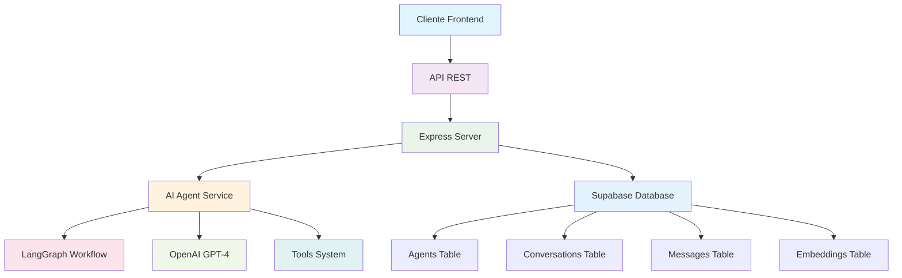

# 🤖 AI Agents Platform - Backend

<div align="center">


**Plataforma de Agentes de IA con capacidades conversacionales avanzadas, herramientas inteligentes y búsqueda semántica**

[🚀 Demo](#-demo) • [📋 Características](#-características) • [🛠️ Instalación](#️-instalación) • [🧪 Pruebas](#-pruebas) • [📚 API](#-api)

</div>

---

## 🎯 ¿Qué es este proyecto?

**AI Agents Platform** es un backend robusto que permite crear, gestionar y conversar con agentes de inteligencia artificial personalizados. Cada agente puede tener su propia personalidad, herramientas especializadas y acceso a información contextual.

### 🌟 **Características principales:**

- 🧠 **Agentes personalizables** con diferentes personalidades y capacidades
- 💬 **Chat inteligente** con contexto e historial de conversaciones
- 🔧 **Herramientas especializadas** (calculadora, fecha/hora, búsqueda web)
- 🔍 **Búsqueda semántica** (RAG) para respuestas más precisas
- 📊 **Base de datos robusta** con Supabase
- 🚀 **API RESTful** completa y documentada
- 🔒 **Seguro y escalable** para producción

---

## 🏗️ Arquitectura



---

## 📋 Características

### 🤖 **Sistema de Agentes**
- ✅ Crear agentes con personalidades únicas
- ✅ Configurar prompts del sistema
- ✅ Ajustar temperatura y modelo de IA
- ✅ Asignar herramientas específicas
- ✅ CRUD completo de agentes

### 💭 **Sistema de Chat**
- ✅ Conversaciones persistentes
- ✅ Historial completo de mensajes
- ✅ Contexto inteligente entre mensajes
- ✅ Respuestas contextuales con RAG
- ✅ Manejo de errores robusto

### 🔧 **Herramientas Inteligentes**
- 🧮 **Calculator**: Operaciones matemáticas
- ⏰ **DateTime**: Fecha y hora actual
- 🔍 **Web Search**: Búsqueda en internet (placeholder)
- 📅 **Appointment Tools**: Sistema completo de gestión de turnos
  - `get_appointments_by_id`: Consultar turnos de un cliente
  - `get_appointments`: Ver disponibilidad de horarios
  - `create_appointment`: Crear nuevos turnos
  - `edit_appointment`: Modificar turnos existentes
  - `confirm_appointment`: Confirmar asistencia
  - `cancel_appointment`: Cancelar turnos
  - `complete_appointment`: Marcar turnos como completados
  - `verify_appointment_payment`: Verificar pagos
- 🔮 **Extensible**: Fácil agregar nuevas herramientas

### 🗄️ **Base de Datos**
- 📊 **Supabase** como backend
- 🔍 **Búsqueda semántica** con embeddings
- 📈 **Escalable** y performante
- 🔒 **Seguro** con RLS (Row Level Security)

---

## 🛠️ Instalación

### **Prerrequisitos**
- Node.js 18+ 
- Cuenta de [Supabase](https://supabase.com)
- API Key de [OpenAI](https://platform.openai.com)

### **1. Clonar y configurar**
```bash
git clone https://github.com/tu-usuario/ai-agents-backend.git
cd ai-agents-backend
npm install
```

### **2. Configurar variables de entorno**
```bash
# Copiar archivo de ejemplo
cp env.example .env

# Editar con tus credenciales
nano .env
```

**Variables requeridas:**
```env
PORT=4000
NODE_ENV=development
SUPABASE_URL=https://tu-proyecto.supabase.co
SUPABASE_SERVICE_ROLE_KEY=tu_service_role_key
OPENAI_API_KEY=sk-tu_openai_key
N8N_APPOINTMENT_API_URL=https://tu-n8n-instance.com/webhook/appointments
LANGSMITH_TRACING=true
LANGSMITH_ENDPOINT=https://api.smith.langchain.com
LANGSMITH_API_KEY=lsv2_xxx
LANGSMITH_PROJECT=ai-agents-backend
```

**Variables opcionales:**
- `FRONTEND_URL`: URL de tu frontend para CORS (opcional en desarrollo)
- `N8N_APPOINTMENT_API_URL`: URL de la API de N8N para gestión de turnos (requerido solo si usas herramientas de turnos)
- `LANGCHAIN_PROJECT`: Alias aceptado por SDK; si está presente se usa como nombre de proyecto

### **3. Configurar base de datos**
1. Ve a tu proyecto en [Supabase](https://supabase.com)
2. Abre **SQL Editor**
3. Ejecuta el contenido de `supabase-schema.sql`
4. Verifica que las tablas se crearon correctamente

### **4. Iniciar servidor**
```bash
# Modo desarrollo
npm run dev

# Modo producción
npm run build
npm start
```

---

## 🧪 Pruebas

### **Opción 1: REST Client (VS Code)**
1. Instala la extensión "REST Client"
2. Abre `test-api.http`
3. Haz click en "Send Request" arriba de cada endpoint

### **Opción 2: Postman**
1. Importa el archivo `test-api.http`
2. Configura las variables de entorno
3. Ejecuta las requests en orden

### **Opción 3: cURL**
```bash
# Health check
curl http://localhost:4000/health

# Crear agente
curl -X POST http://localhost:4000/api/agents \
  -H "Content-Type: application/json" \
  -d '{
    "name": "Mi Asistente",
    "description": "Un asistente útil",
    "system_prompt": "Eres un asistente amigable",
    "tools": ["calculator", "datetime"]
  }'
```

### **Flujo de prueba completo:**
1. ✅ **Health Check** → Verificar servidor
2. 🤖 **Crear Agente** → Guardar ID
3. 💬 **Crear Conversación** → Guardar ID  
4. 💭 **Enviar Mensaje** → Probar chat
5. 🔧 **Probar Tools** → Calculator, DateTime
6. 📜 **Ver Historial** → Mensajes guardados

---

## 📚 API

### **Endpoints principales:**

| Método | Endpoint | Descripción |
|--------|----------|-------------|
| `GET` | `/health` | Estado del servidor |
| `GET` | `/` | Información de la API |

### **🤖 Agentes**
| Método | Endpoint | Descripción |
|--------|----------|-------------|
| `GET` | `/api/agents` | Listar agentes |
| `POST` | `/api/agents` | Crear agente |
| `GET` | `/api/agents/:id` | Obtener agente |
| `PUT` | `/api/agents/:id` | Actualizar agente |
| `DELETE` | `/api/agents/:id` | Eliminar agente |

### **💬 Conversaciones**
| Método | Endpoint | Descripción |
|--------|----------|-------------|
| `GET` | `/api/conversations` | Listar conversaciones |
| `POST` | `/api/conversations` | Crear conversación |
| `GET` | `/api/conversations/:id` | Obtener conversación + mensajes |
| `PUT` | `/api/conversations/:id` | Actualizar conversación |
| `DELETE` | `/api/conversations/:id` | Eliminar conversación |

### **💭 Chat**
| Método | Endpoint | Descripción |
|--------|----------|-------------|
| `POST` | `/api/chat` | Enviar mensaje |
| `GET` | `/api/chat/messages/:id` | Obtener mensajes |

---

## 🚀 Deploy

### **Railway (Recomendado)**
```bash
# 1. Subir a GitHub
git init
git add .
git commit -m "Backend ready"
git push origin main

# 2. Conectar con Railway
# - Ve a https://railway.app
# - Importa tu repositorio
# - Configura variables de entorno
# - Deploy automático
```

### **Render**
```bash
# 1. Crear render.yaml
# 2. Subir a GitHub  
# 3. Conectar con Render
# 4. Configurar variables
# 5. Deploy
```

### **Vercel**
```bash
# 1. Instalar Vercel CLI
npm install -g vercel

# 2. Deploy
vercel --prod
```

---

## 🔧 Herramientas Disponibles

### **🧮 Calculator**
```json
{
  "name": "calculator",
  "description": "Realiza operaciones matemáticas",
  "triggers": ["calcula", "suma", "resta", "multiplica", "divide", "cuánto es"]
}
```

### **⏰ DateTime**
```json
{
  "name": "datetime", 
  "description": "Obtiene fecha y hora actual",
  "triggers": ["fecha", "hora", "tiempo", "ahora", "qué hora"]
}
```

### **🔍 Web Search**
```json
{
  "name": "web_search",
  "description": "Busca información en internet", 
  "triggers": ["busca", "buscar", "información"]
}
```

---

## 📊 Ejemplos de Uso

### **Crear un agente matemático:**
```json
POST /api/agents
{
  "name": "Profesor de Matemáticas",
  "description": "Experto en resolver problemas matemáticos",
  "system_prompt": "Eres un profesor de matemáticas que explica paso a paso.",
  "model": "gpt-4-turbo-preview",
  "temperature": 0.3,
  "tools": ["calculator"]
}
```

### **Enviar mensaje con cálculo:**
```json
POST /api/chat
{
  "conversation_id": "uuid-de-conversacion",
  "agent_id": "uuid-de-agente", 
  "message": "¿Cuánto es 25 * 4 + 17?"
}
```

### **Respuesta del agente:**
```json
{
  "response": {
    "role": "assistant",
    "content": "El resultado de 25 * 4 + 17 es 117. Te explico el cálculo paso a paso: 25 * 4 = 100, luego 100 + 17 = 117.",
    "timestamp": "2025-10-06T01:30:00.000Z"
  }
}
```

---

## 🛡️ Seguridad

- ✅ **Variables de entorno** para credenciales
- ✅ **Validación de entrada** en todos los endpoints
- ✅ **Manejo de errores** robusto
- ✅ **Rate limiting** (configurable)
- ✅ **CORS** configurado
- ✅ **Logs** detallados para debugging

---

## 📈 Monitoreo

### **Logs del servidor:**
```bash
# Ver logs en tiempo real
npm run dev

# Logs de producción
pm2 logs ai-agents-backend
```

### **Métricas importantes:**
- 📊 Requests por minuto
- ⏱️ Tiempo de respuesta
- 🧠 Uso de tokens de OpenAI
- 💾 Uso de base de datos

---

## 🤝 Contribuir

1. **Fork** el repositorio
2. **Crea** una rama para tu feature (`git checkout -b feature/nueva-funcionalidad`)
3. **Commit** tus cambios (`git commit -m 'Agregar nueva funcionalidad'`)
4. **Push** a la rama (`git push origin feature/nueva-funcionalidad`)
5. **Abre** un Pull Request

---

## 📄 Licencia

Este proyecto está bajo la Licencia MIT. Ver el archivo `LICENSE` para más detalles.

---

## 🆘 Soporte

- 📧 **Email**: tu-email@ejemplo.com
- 🐛 **Issues**: [GitHub Issues](https://github.com/tu-usuario/ai-agents-backend/issues)
- 📖 **Documentación**: [Wiki del proyecto](https://github.com/tu-usuario/ai-agents-backend/wiki)

---

<div align="center">

**¿Te gusta este proyecto? ¡Dale una ⭐ en GitHub!**


</div>